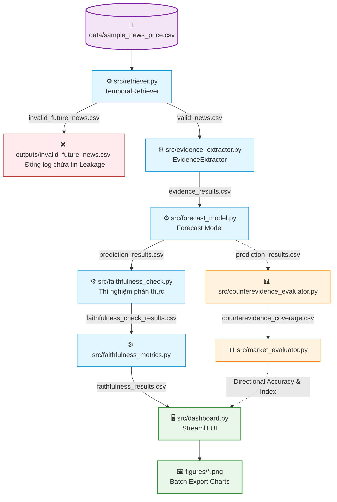

# 📈 Faithful Evidence-Centric Financial News Forecasting

Prototype dự báo xu hướng cổ phiếu (**UP / DOWN / HOLD**) từ tin tức tài chính theo
hướng **Faithful AI**: evidence không chỉ được *hiển thị* như một lời giải thích, mà
phải được **kiểm chứng** là thật sự dẫn tới prediction.

> *Evidence mà mô hình trích dẫn có thật sự là **nguyên nhân** của prediction, hay chỉ
> là một rationale hợp lý được gán thêm sau khi đã dự báo?*

Đồ án trả lời câu hỏi đó bằng ba trụ cột: **chống rò rỉ thời gian (temporal leakage)**,
**đối chiếu counter-evidence**, và **kiểm thử "remove cited evidence"** để đo mức độ
phụ thuộc thực sự của prediction vào bằng chứng.

---

## 1. Tính năng chính

- **Temporal Retriever** — chỉ dùng tin có `news_time ≤ forecast_time`, tự động phát
  hiện & loại bỏ tin "tương lai" (temporal leakage).
- **Evidence Extractor** — trích xuất bằng chứng theo từ khóa sắc thái (sentiment keywords), phân loại
  *pro-evidence* / *counter-evidence*.
- **Forecast Model** — quy tắc minh bạch `score = positive − negative` → UP/DOWN/HOLD
  kèm confidence.
- **Faithfulness Check & Metrics** — thí nghiệm phản thực (bỏ evidence) và 3 chỉ số:
  Evidence Support, Temporal Validity, Confidence Drop.
- **Counterevidence Evaluator** — đo tỷ lệ bao phủ bằng chứng trái chiều.
- **Market Evaluator** — Đánh giá độ chính xác hướng đi (Directional Accuracy), chỉ số nhất quán dòng tiền (Weighted Consistency Index) và phân tích trạng thái thị trường (Market Regime Analysis).
- **Dashboard (Streamlit)** — giao diện tương tác theo kịch bản demo 5 phút + 4 biểu đồ
  tổng hợp xuất PNG.

---

## 2. Kiến trúc pipeline



Nhánh phụ: `counterevidence_evaluator.py` và `market_evaluator.py` chạy ở cuối pipeline để đánh giá độ bao phủ bằng chứng trái chiều và đối chiếu hiệu năng với dữ liệu thị trường.

---

## 3. Cấu trúc thư mục

```
faithful-evidence-forecasting-main/
├── data/
│   └── sample_news_price.csv      # Dataset đầu vào
├── src/
│   ├── retriever.py               # Temporal Retriever — lọc leakage
│   ├── evidence_extractor.py      # Trích xuất & phân loại evidence
│   ├── forecast_model.py          # Mô hình dự báo UP/DOWN/HOLD
│   ├── faithfulness_check.py      # Thí nghiệm phản thực (remove evidence)
│   ├── faithfulness_metrics.py    # 3 chỉ số faithfulness
│   ├── counterevidence_evaluator.py
│   ├── market_evaluator.py        # Đối chiếu với thị trường thực
│   └── dashboard.py               # Streamlit UI + xuất biểu đồ PNG
├── outputs/                       # CSV & figures sinh ra khi chạy pipeline
├── figures/                       # 4 biểu đồ .png (batch dashboard)
├── tests/                         # pytest (temporal, metrics, streamlit…)
├── openspec/                      # Đặc tả (proposal, design, tasks)
├── requirements.txt
└── README.md
```

---

## 4. Cài đặt

Yêu cầu **Python 3.10+** (đã kiểm thử trên Python 3.14).

```bash
python -m venv .venv
# Windows:  .venv\Scripts\activate
# macOS/Linux:  source .venv/bin/activate

pip install -r requirements.txt
```

---

## 5. Cách chạy

> Chạy **từ thư mục gốc** dự án. Mỗi script dùng đường dẫn tương đối `data/…`,
> `outputs/…` và tự thêm `src/` vào path khi gọi trực tiếp.

### 5.1. Chạy pipeline theo thứ tự

```bash
python src/retriever.py            # 1. Lọc tin hợp lệ / leakage
python src/evidence_extractor.py   # 2. Trích xuất evidence
python src/forecast_model.py       # 3. Dự báo + in accuracy/confusion matrix
python src/faithfulness_check.py   # 4. Thí nghiệm phản thực
python src/faithfulness_metrics.py # 5. Tính 3 chỉ số faithfulness
python src/counterevidence_evaluator.py  # (tùy chọn) bao phủ counter-evidence
python src/market_evaluator.py           # (tùy chọn) đối chiếu thị trường
```

### 5.2. Dashboard

```bash
# Giao diện tương tác (kịch bản demo 5 phút)
streamlit run src/dashboard.py

# Hoặc chế độ batch: xuất 4 biểu đồ .png vào figures/
python src/dashboard.py --outdir figures

# Chạy thử không cần outputs/ (dữ liệu placeholder)
python src/dashboard.py --demo
```

Dashboard tương tác dẫn dắt đúng **10 bước demo**: chọn ticker → chọn forecast date →
xem tin hợp lệ → dự báo → evidence & rationale → *Remove cited evidence* → so sánh
confidence trước/sau → kết luận faithful → limitation.

---

## 6. Định dạng dữ liệu

### Đầu vào — `data/sample_news_price.csv`

| Cột | Ý nghĩa |
|-----|---------|
| `ticker` | Mã cổ phiếu (AAPL, MSFT, …) |
| `forecast_time` | Thời điểm ra dự báo |
| `news_time` | Thời điểm phát hành tin (nếu `> forecast_time` → leakage) |
| `news_text` | Nội dung tin tức |
| `price_5d_return` | % thay đổi giá 5 ngày (dùng cho market evaluator) |
| `volume_change` | % thay đổi khối lượng |
| `label` | Nhãn thực tế UP/DOWN/HOLD (ground truth) |

Dataset mẫu gồm **100 dòng / 23 mã cổ phiếu**, mỗi khối gồm tin tăng, tin giảm, một
tin "tương lai" (minh họa leakage) và tin trung tính, cộng vài tin **trái chiều** để
thử counter-evidence.

### Đầu ra chính — `outputs/prediction_results.csv`

Bổ sung `evidence_text`, `sentiment`, `expected_direction`, `pro_evidence`,
`counter_evidence`, `score`, `confidence`, `prediction`.

---

## 7. Các chỉ số đánh giá hệ thống (Metrics)

Hệ thống sử dụng hai bộ chỉ số độc lập để đánh giá toàn diện: (1) Tính trung thực của lời giải thích và (2) Tính nhất quán toán học đối với thị trường thực tế.

### 7.1. Chỉ số Trung thực (Faithfulness Metrics)

| Chỉ số | Ý nghĩa | Ngưỡng đạt |
|--------|---------|------------|
| **Evidence Support (ES)** | Dự báo (Prediction) có được nâng đỡ và đồng nhất bởi hướng kỳ vọng của bằng chứng trích dẫn không. | Tỷ lệ % |
| **Temporal Validity (TV)** | Đảm bảo dự báo chỉ dựa trên tin hợp lệ (tuyệt đối không sử dụng thông tin tương lai - loại bỏ leakage). | 1.00 (100%) |
| **Confidence Drop (CD)** | Mức độ sụt giảm niềm tin của mô hình khi **bỏ đi bằng chứng (cited evidence)**. Điểm sụt giảm càng cao ⇒ bằng chứng thực sự đóng vai trò quyết định suy luận, không phải "trang trí". | ≥ **0.10** |

### 7.2. Chỉ số Nhất quán Thị trường (Market Consistency Metrics)

| Chỉ số / Thông tin | Ý nghĩa học thuật | Định dạng hiển thị |
|--------------------|-------------------|-------------------|
| **Directional Accuracy** | Tỷ lệ mô hình dự báo đúng hướng dịch chuyển giá thực tế của cổ phiếu (UP/DOWN/HOLD) sau 5 ngày. | Phần trăm (0% - 100%) |
| **Weighted Consistency Index** | Chỉ số đo mức độ đồng thuận giữa dự báo đúng và dòng tiền thực. Hệ thống cộng thưởng trọng số (1.2) cho các ca đoán đúng xu hướng đi kèm bùng nổ thanh khoản ($Volume > 10\%$). | Số thực (Baseline = 1.00) |
| **Market Regime Analysis** | Trạng thái vĩ mô của thị trường dựa trên biến động giao dịch trung bình (`Avg Return` và `Avg Volume Change`), phân loại thành *Bullish*, *Bearish*, hoặc *Sideway*. | Chuỗi ký tự & Số % |

---

## 8. Kiểm thử

```bash
pytest -q
```

Bộ test gồm: temporal retriever, faithfulness metrics, và giao diện Streamlit
(`streamlit.testing.AppTest`). Test UI tự bỏ qua nếu chưa cài `streamlit`.

---

## 9. Giới hạn (Limitations)

- **Bằng chứng dựa trên từ khóa**: evidence rút bằng danh sách từ khóa sắc thái cố định
  nên mô hình *faithful theo thiết kế* nhưng **chưa hiểu ngữ cảnh/mỉa mai** và có thể
  **bỏ sót bằng chứng diễn đạt gián tiếp**.
- Dataset là dữ liệu **mô phỏng phục vụ học tập**, không phản ánh thị trường thực.
- Với LLM hộp đen, faithful không còn được bảo đảm — đây chính là lúc bài kiểm tra
  *remove cited evidence* trở nên thiết yếu.

---

Đặc tả chi tiết: xem thư mục [`openspec/`](openspec/). Link video demo:
[`demo_video_link.txt`](demo_video_link.txt).

> ⚠️ Chỉ phục vụ mục đích học tập.
