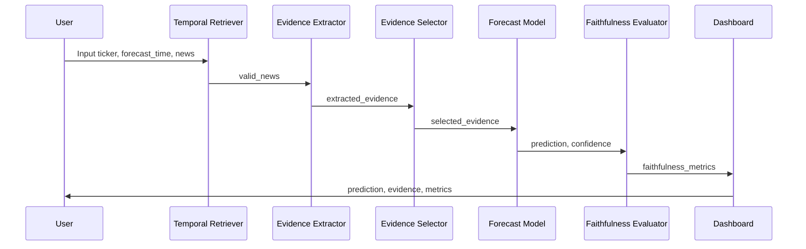
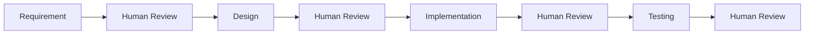

# Design Document

## 1. Tổng quan thiết kế

### Tên hệ thống

Faithful Evidence-Centric Financial News Forecasting

### Mục tiêu thiết kế

## 2. Kiến trúc tổng thể

### a. Kiến trúc Pipeline


### b. Luồng xử lý

#### Bước 1: Nhận dữ liệu

Hệ thống nhận:

- ticker
- forecast_time
- news
- price_features

#### Bước 2: Temporal Retrieval

Lọc bỏ các tin có:

`news_time` > `forecast_time`

Mục tiêu:

- Ngăn temporal leakage.
- Đảm bảo tính hợp lệ của thực nghiệm.

#### Bước 3: Evidence Extraction

Từ mỗi tin tức:

- Trích xuất evidence.
- Xác định polarity.
- Gán expected_direction.

Ví dụ:

Apple reports weak iPhone sales

- Evidence: weak iPhone sales
- Polarity: negative
- Direction: DOWN

#### Bước 4: Evidence Selection

Chọn evidence quan trọng nhất cho prediction.

Phân loại:

- Pro Evidence
- Counterevidence

#### Bước 5: Forecasting

Sinh:

- Prediction
- Confidence Score

Các nhãn:

- UP
- DOWN
- HOLD

#### Bước 6: Faithfulness Evaluation

Đánh giá:

- Evidence Support
- Temporal Validity
- Confidence Drop

#### Bước 7: Visualization

Hiển thị:

- Prediction
- Evidence
- Faithfulness Metrics
- Warnings

### c. Sequence Diagram

Sơ đồ dưới đây mô tả luồng tương tác giữa các module trong hệ thống từ khi nhận dữ liệu đầu vào đến khi hiển thị kết quả.



## 3. Cấu trúc thư mục mã nguồn

project_root/
  data/
    sample_news_price.csv
  src/
    retriever.py
    evidence_extractor.py
    evidence_selector.py
    forecast_model.py
    faithfulness_metrics.py
    dashboard.py
  tests/
    test_temporal_retriever.py
    test_metrics.py
  outputs/
    prediction_results.csv
    faithfulness_results.csv
    figures/
      prediction_distribution.png
      confidence_drop.png
      temporal_leakage_warning.png
      faithfulness_radar.png
  openspec/

## 4. Thiết kế dữ liệu

### a. Input Schema

```json
{
  "ticker": "AAPL",
  "forecast_time": "2025-03-12 09:00",
  "news": [
    {
      "news_id": "N001",
      "news_time": "2025-03-11 08:30",
      "title": "Apple reports weak iPhone sales in China",
      "text": "..."
    }
  ],
  "price_features": {
    "price_5d_return": -0.02,
    "volume_change": 0.15
  },
  "label": "DOWN"
}
```

### c. Dataset Schema

| Field | Type | Description |
|--------|--------|--------|
| ticker | string | Mã cổ phiếu |
| forecast_time | datetime | Thời điểm dự báo |
| news_id | string | Mã tin tức |
| news_time | datetime | Thời điểm xuất bản tin |
| title | string | Tiêu đề tin tức |
| news_text | string | Nội dung tin tức |
| price_5d_return | float | Biến động giá 5 ngày |
| volume_change | float | Biến động khối lượng giao dịch |
| label | string | Nhãn thực tế (UP/DOWN/HOLD) |

### c. Output Schema

```json
{
  "ticker": "AAPL",
  "prediction": "DOWN",
  "confidence": 0.72,
  "evidence": [
    {
      "news_id": "N001",
      "evidence_text": "weak iPhone sales in China",
      "polarity": "negative",
      "expected_direction": "DOWN",
      "support_score": 1.0
    }
  ],
  "faithfulness": {
    "temporal_validity": 1.0,
    "evidence_support": 1.0,
    "confidence_drop": 0.21
  }
}
```

## 5. Thiết kế các Module

### a. Temporal Retriever

#### Mục tiêu

Loại bỏ dữ liệu tương lai.

#### Input

forecast_time
news_list

#### Output

valid_news
invalid_future_news

#### Thuật toán

For each news:

  If news_time <= forecast_time: 
    valid_news
  Else:
    invalid_future_news

### b. Evidence Extractor

#### Mục tiêu

Trích xuất evidence từ nội dung tin tức.

#### Input

news_text

#### Output

evidence_text
polarity
expected_direction

#### Phiên bản cơ bản

Rule-based keyword matching.

Ví dụ:

| Keyword | Polarity |
|--------|--------|
| beats expectations | positive |
| strong growth | positive |
| weak sales | negative |
| misses expectations | negative |

### c. Evidence Selector

#### Mục tiêu

Chọn evidence quan trọng nhất.

#### Output

pro_evidence
counterevidence

#### Chiến lược:

Ưu tiên:

- Evidence có sentiment mạnh.
- Evidence xuất hiện nhiều lần.
- Evidence gần thời điểm dự báo.

### d. Forecast Model

#### Phiên bản cơ bản

Rule-based.

#### Công thức

score = positive_count - negative_count

positive_count = số evidence positive

negative_count = số evidence negative

confidence = |score| / total_evidence

Quy tắc:

- score > 0 -> UP
- score < 0 -> DOWN
- score = 0 -> HOLD

#### Confidence

confidence = abs(score) / total_evidence

### e. Faithfulness Evaluator

#### Evidence Support

ES = supporting_evidence / total_evidence

#### Temporal Validity

TV = valid_evidence / total_evidence

#### Confidence Drop

CD = original_confidence - confidence_without_evidence

## 6. Thiết kế Error Handling

### Mục tiêu

Đảm bảo hệ thống vẫn hoạt động ổn định khi gặp dữ liệu không hợp lệ hoặc thiếu thông tin.

### Trường hợp 1: Missing forecast_time

Input:

- forecast_time = null

Hành động:

- Dừng xử lý bản ghi.
- Ghi log lỗi.

Output:

```json
{
  "error": "Missing forecast_time"
}
```

### Trường hợp 2: Missing news_time

Input:

- news_time = null

Hành động:

- Loại bỏ bản tin.
- Ghi log lỗi.

Output:

- invalid_news

### Trường hợp 3: Empty news list

Input:

```json
{
  "news": []
}
```

Hành động:

- Không thực hiện Evidence Extraction.

Output:

```json
{
  "prediction": "HOLD",
  "confidence": 0.0
}
```

### Trường hợp 4: Invalid datetime format

Ví dụ: `2025/13/40`

Hành động:

- Đánh dấu dữ liệu không hợp lệ.
- Ghi log lỗi.

Error Log Schema:

```json
{
  "timestamp": "2025-03-12 09:00",
  "module": "Temporal Retriever",
  "error_type": "Missing news_time",
  "record_id": "N001"
}
```

## 7. Thiết kế Dashboard

### a. Công nghệ

Phiên bản cơ bản: Jupyter Notebook hoặc Streamlit

### b. Màn hình chính

#### Prediction Panel

Ticker: AAPL

Prediction: DOWN

Confidence: 0.72

#### Evidence Table

| Evidence | Direction | Support |
|--------|--------|--------|
| weak iPhone sales | DOWN | 1.0 |

#### Faithfulness Metrics

| Metric | Value |
|--------|--------|
| Evidence Support | 1.0 |
| Temporal Validity | 1.0 |
| Confidence Drop | 0.21 |

#### Temporal Leakage Warning

⚠ 2 future news articles detected

## 8. Thiết kế biểu đồ

#### Biểu đồ 1

Prediction Distribution

- UP
- DOWN
- HOLD

Biểu đồ cột thể hiện số lượng prediction.

#### Biểu đồ 2

Confidence Drop

- Original Confidence
- Without Evidence

Biểu đồ cột so sánh.

#### Biểu đồ 3

Temporal Leakage

- Valid News
- Invalid News

Biểu đồ tròn.

#### Biểu đồ 4

Faithfulness Radar

Các trục:

- Support
- Temporal Validity
- Confidence Drop
- Sufficiency (nâng cao)
- Counterevidence Coverage (nâng cao)

## 9. Thiết kế Testing

### Unit Test

#### test_temporal_retriever.py

Kiểm tra:

- Tin hợp lệ.
- Tin tương lai.
- Nhiều tin cùng lúc.

#### test_metrics.py

Kiểm tra:

- Evidence Support.
- Temporal Validity.
- Confidence Drop.

## 10. Thiết kế Agentic SDLC

### Research Agent

Nhiệm vụ:

- Phân tích yêu cầu.
- Đề xuất metric.
- Xây dựng OpenSpec.

Output: proposal.md, spec.md

### Coding Agent

Nhiệm vụ:

- Sinh code mẫu.
- Sinh cấu trúc module.

Output: src/

### Testing Agent

Nhiệm vụ:

- Sinh test cases.
- Sinh dữ liệu lỗi.

Output: tests/

### Human Review Gate

Mỗi giai đoạn phải được nhóm kiểm tra trước khi chuyển sang bước tiếp theo.



## 11. Requirement Traceability

| Requirement | Mô tả | Module thiết kế |
|------------|--------|----------------|
| FR-01 | Data Loading | Data Layer / Input Schema |
| FR-02 | Temporal Retriever | Temporal Retriever |
| FR-03 | Evidence Extraction | Evidence Extractor |
| FR-04 | Evidence Selection | Evidence Selector |
| FR-05 | Forecast Model | Forecast Model |
| FR-06 | Faithfulness Evaluation | Faithfulness Evaluator |
| FR-07 | Visualization Dashboard | Dashboard |

## 12. Rủi ro và Giới hạn

- Dataset nhỏ có thể gây bias.
- Rule-based model có độ chính xác thấp.
- Evidence extraction có thể bỏ sót thông tin quan trọng.
- Confidence không phản ánh xác suất thực tế.
- Faithfulness metric chỉ đánh giá một phần khả năng giải thích.
- Không sử dụng cho quyết định đầu tư thực tế.