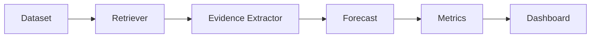

# Tasks

## Tổng quan

Tài liệu này mô tả các công việc cần thực hiện để xây dựng hệ thống **Faithful Evidence-Centric Financial News Forecasting** theo quy trình Agentic SDLC.

## Milestone 1: Requirement Analysis

### TASK-001: Phân tích yêu cầu

**Mục tiêu**

Hiểu bài toán, xác định phạm vi và yêu cầu của hệ thống.

**Output**

- proposal.md
- spec.md

**Độ ưu tiên**

High

**Trạng thái**

Completed

### TASK-002: Xây dựng OpenSpec

**Mục tiêu**

Hoàn thiện các tài liệu OpenSpec.

**Output**

- proposal.md
- design.md
- spec.md
- tasks.md

**Độ ưu tiên**

High

**Trạng thái**

Completed

## Milestone 2: Dataset Preparation

### TASK-003: Xây dựng Dataset

**Mục tiêu**

Chuẩn bị dữ liệu đầu vào.

**Yêu cầu**

- Tối thiểu 30 mẫu.
- Có ticker.
- Có forecast_time.
- Có news_time.
- Có news_text.
- Có label.

**Output**

data/sample_news_price.csv

**Độ ưu tiên**

High

**Trạng thái**

Completed

### TASK-004: Kiểm tra dữ liệu

**Mục tiêu**

Đảm bảo dữ liệu hợp lệ.

**Kiểm tra**

- Thiếu dữ liệu.
- Sai định dạng thời gian.
- Trùng dữ liệu.
- Temporal Leakage.

**Output**

Dataset sạch.

**Độ ưu tiên**

Medium

**Trạng thái**

Completed

## Milestone 3: Temporal Retriever

### TASK-005: Xây dựng Temporal Retriever

**Mục tiêu**

Lọc tin tức hợp lệ.

**Input**

- forecast_time
- news_list

**Output**

- valid_news
- invalid_future_news

src/retriever.py

**Độ ưu tiên**

High

**Trạng thái**

Completed

### TASK-006: Unit Test cho Temporal Retriever

**Mục tiêu**

Kiểm tra khả năng phát hiện Temporal Leakage.

**Test Cases**

- Tin hợp lệ.
- Tin trong tương lai.
- Danh sách nhiều tin.

**Output**

tests/test_temporal_retriever.py

**Độ ưu tiên**

High

**Trạng thái**

Completed

## Milestone 4: Evidence Extraction

### TASK-007: Xây dựng Evidence Extractor

**Mục tiêu**

Trích xuất evidence từ tin tức.

**Input**

news_text

**Output**

- evidence_text
- polarity
- expected_direction

src/evidence_extractor.py

**Độ ưu tiên**

High

**Trạng thái**

Completed

### TASK-008: Xây dựng Evidence Selector

**Mục tiêu**

Lựa chọn evidence quan trọng nhất.

**Output**

- pro evidence
- counterevidence

**Độ ưu tiên**

High

**Trạng thái**

Completed

## Milestone 5: Forecast Model

### TASK-009: Xây dựng Forecast Model

**Mục tiêu**

Sinh prediction.

**Prediction**

- UP
- DOWN
- HOLD

**Confidence**

```text
[0; 1]
```

**Output**

src/forecast_model.py

**Độ ưu tiên**

High

**Trạng thái**

Completed

### TASK-010: Đánh giá mô hình

**Mục tiêu**

Tính:

- Accuracy
- Confusion Matrix

**Output**

outputs/prediction_results.csv

**Độ ưu tiên**

Medium

**Trạng thái**

Completed

## Milestone 6: Faithfulness Evaluation

### TASK-011: Tính Evidence Support

**Output**

Support Score

**Độ ưu tiên**

High

**Trạng thái**

Completed

### TASK-012: Tính Temporal Validity

**Output**

Temporal Validity

**Độ ưu tiên**

High

**Trạng thái**

Completed

### TASK-013: Tính Confidence Drop

**Output**

Confidence Drop

**Độ ưu tiên**

High

**Trạng thái**

Completed

### TASK-014: Xuất Faithfulness Metrics

**Output**

outputs/faithfulness_results.csv

**Độ ưu tiên**

Medium

**Trạng thái**

Completed

## Milestone 7: Visualization Dashboard

### TASK-015: Xây dựng Dashboard

Dashboard phải hiển thị:

- Prediction
- Confidence
- Evidence
- Faithfulness Metrics

**Output**

src/dashboard.py

**Độ ưu tiên**

High

**Trạng thái**

Completed

### TASK-016: Prediction Distribution

Sinh biểu đồ:

Prediction Distribution

**Output**

figures/prediction_distribution.png

### TASK-017: Confidence Drop Chart

Sinh biểu đồ:

Confidence Drop

**Output**

figures/confidence_drop.png

### TASK-018: Temporal Leakage Visualization

Sinh biểu đồ:

Temporal Leakage Warning

**Output**

figures/temporal_leakage_warning.png

### TASK-019: Faithfulness Radar

Sinh Radar Chart.

**Output**

figures/faithfulness_radar.png

## Milestone 8: Testing

### TASK-020: Unit Test

Kiểm tra:

- Retriever
- Evidence Extractor
- Forecast Model
- Faithfulness Metrics

**Output**

tests/

### TASK-021: Integration Test

Kiểm tra toàn bộ pipeline.



## Milestone 9: Documentation

### TASK-022: README

Viết hướng dẫn chạy dự án.

**Output**

README.md

### TASK-023: Report

Viết báo cáo.

Nội dung:

- Giới thiệu.
- Thiết kế.
- Thực nghiệm.
- Đánh giá.
- Hạn chế.

**Output**

report.pdf

### TASK-024: Demo Video

Quay video demo.

Thời lượng:

5–10 phút.

## Milestone 10: Quality Gate

### TASK-025: Human Review

Kiểm tra:

- OpenSpec
- Dataset
- Source Code
- Dashboard
- Testing
- Report

Điều kiện hoàn thành:

- Không còn lỗi nghiêm trọng.
- Toàn bộ test thành công.
- Dashboard hoạt động.
- Kết quả có thể tái lập.

## Phân công thành viên

| Thành viên | Vai trò | Công việc |
|------------|---------|--------------|
| Thành viên 1 | Research & Spec Owner | TASK-001 → TASK-004, TASK-022, TASK-023 |
| Thành viên 2 | ML/NLP Engineer | TASK-005 → TASK-014 |
| Thành viên 3 | Visualization & QA Engineer | TASK-015 → TASK-025 |

## Tiêu chí hoàn thành dự án

Dự án được xem là hoàn thành khi đáp ứng các điều kiện sau:

- Hoàn thành toàn bộ tài liệu OpenSpec.
- Dataset có tối thiểu 30 mẫu hợp lệ.
- Temporal Retriever hoạt động chính xác.
- Evidence Extractor trích xuất được evidence.
- Forecast Model dự báo được UP/DOWN/HOLD.
- Tính được các Faithfulness Metrics.
- Dashboard hiển thị đầy đủ thông tin.
- Toàn bộ Unit Test và Integration Test thành công.
- Có README, báo cáo và video demo.